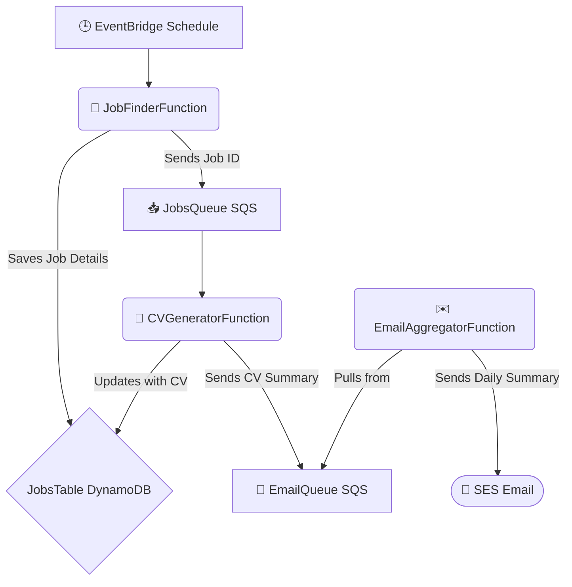

# JobFinder

This serverless application automatically finds jobs with **SerpApi**, tailors a CV for each using **Google Gemini**, and sends a daily email summary.

***

## How to Use

Follow these steps to get the application running.

### 1. Prerequisites

Before starting, you need:
- An **AWS Account** with the **SAM CLI** installed.
- API keys for **SerpApi** and **Google Gemini**.
- An email address to be **verified in Amazon SES** so it receive notifications.

### 2. Configure Your Resume Data

The application needs a resume file plus a short plain-text summary of your experience.

-   In `src/cv_generator/config/`, review `resume.yaml`. A sample template is also included as `resume.sample.yaml`.
-   In **both** `src/cv_generator/config/` and `src/job_finder/config/`, create `cv_summary.txt` from the included `cv_summary.sample.txt` template and customize it with your own experience.

### 3. Deploy the Application

Clone the repository and use the SAM CLI to build and deploy the AWS resources. The guided deployment will prompt you for your secret keys and verified email.

```bash
# Clone the repository
git clone <your-repo-url>
cd JobFinder

# Build the application
sam build

# Deploy with guided prompts
sam deploy --guided
```

During guided deployment, you can leave `NoCvGen` set to `true` to skip CV generation and email job matches directly, or set it to `false` to generate tailored CVs.

Architecture Diagram



```mermaid
graph TD
    A[🕒 EventBridge Schedule] --> B(🔎 JobFinderFunction);
    B -->|Saves Job Details| C{JobsTable DynamoDB};
    B -->|Sends Job ID| D[📥 JobsQueue SQS];
    D --> E(📄 CVGeneratorFunction);
    E -->|Updates with CV| C;
    E -->|Sends CV Summary| F[📮 EmailQueue SQS];
    G(✉️ EmailAggregatorFunction) -->|Pulls from| F;
    G -->|Sends Daily Summary| H([📧 SES Email]);
```
