# JobFinder

This serverless application automatically finds jobs with **SerpApi**, tailors a CV for each using **Google Gemini**, and sends a daily email summary.

***

## How to Use

Follow these steps to get the application running.

### 1. Prerequisites

Before starting, you need:
- An **AWS Account** with the **SAM CLI** installed.
- API keys for **SerpApi** and **Google Gemini**.
- An email address to be **verified in Amazon SES** so it receive notifications.

### 2. Configure Your CV Summary

The application uses a summary of your CV to tailor applications. You must create this file before deploying.

-   In **both** of those `config` directories of `src/cv_generator/` and  `src/job_finder/`, create a file named `cv_summary.txt`.
-   Inside `cv_summary.txt`, put a plain text summary of your professional skills and experience.

### 3. Deploy the Application

Clone the repository and use the SAM CLI to build and deploy the AWS resources. The guided deployment will prompt you for your secret keys and verified email.

```bash
# Clone the repository
git clone [https://github.com/nimamoradi/JobFinder.git](https://github.com/nimamoradi/JobFinder.git)
cd JobFinder

# Build the application
sam build

# Deploy with guided prompts
sam deploy --guided
```

Architecture Diagram

```mermaid
graph TD
    A[🕒 EventBridge Schedule] --> B(🔎 JobFinderFunction);
    B -->|Saves Job Details| C{JobsTable DynamoDB};
    B -->|Sends Job ID| D[📥 JobsQueue SQS];
    D --> E(📄 CVGeneratorFunction);
    E -->|Updates with CV| C;
    E -->|Sends CV Summary| F[📮 EmailQueue SQS];
    G(✉️ EmailAggregatorFunction) -->|Pulls from| F;
    G -->|Sends Daily Summary| H([📧 SES Email]);
```



